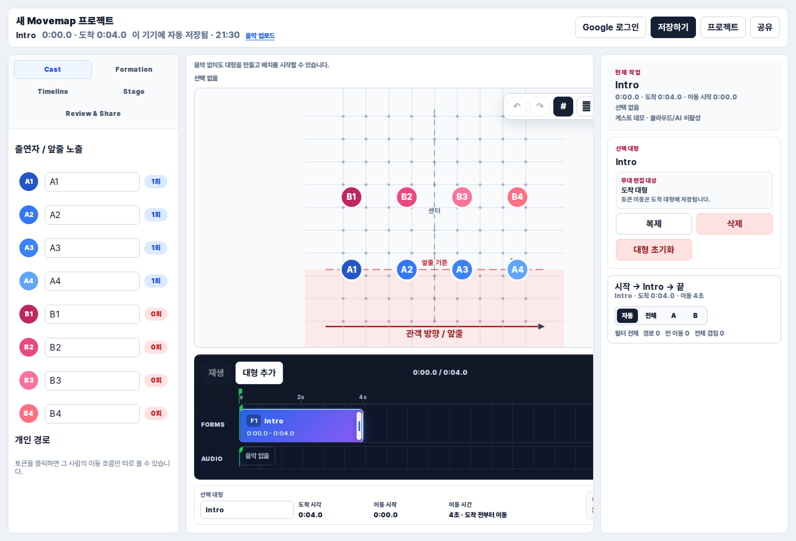

# Movemap

[](https://github.com/ydhcjswovibe/Movemap/actions/workflows/ci.yml)

Movemap is an open-source choreography and rehearsal mapping tool for dance teams,
performance crews, salsa and partner dance teams, choreographers, and rehearsal
leaders. It helps teams plan stage formations, performer movement paths,
music-cue-based timing, and shareable rehearsal maps without depending on
screenshots, paper diagrams, spreadsheets, or group chat memory.

Movemap exists because stage and rehearsal planning often gets split across
paper diagrams, screenshots, spreadsheets, and group chat. The goal is to make
formation planning easier to edit, review, share, and rehearse with timing
context.

The project is early-stage. It is useful for local experimentation and review,
but the contributor surface and hosted workflows are still being refined. The
current public deployment referenced by the project is
`https://stage-map-pi.vercel.app`, and the app includes a public about page at
`/about`.



## Who it is for

- Choreographers and rehearsal leaders planning dance formations.
- Salsa, partner dance, and performance teams coordinating paired movement.
- Stage managers or performing arts contributors who need a lightweight
  formation map.
- Developers interested in open-source tools for choreography, rehearsal, and
  performing arts workflows.

## Key features

- Create a performance map with role-based performer tokens.
- Edit formation points on a stage canvas.
- Set arrival time, movement duration, notes, and pair/partner details.
- Upload music for local playback and Supabase-backed reuse when configured.
- Share maps with view/edit links, PNG export, print/PDF, or project file
  backup.
- Preview stage movement with the existing React/Vite interface.

## Tech stack

- React 19
- Vite 7
- Three.js
- Supabase for optional auth, project storage, sharing, and audio storage
- Node.js built-in test runner for unit tests
- Playwright for browser smoke tests

## Local setup

```bash
npm install
cp .env.example .env
npm run dev
```

Open `http://localhost:5174` after the dev server starts. The Vite dev server is
configured with a strict `5174` port; stop any existing process on that port if
startup fails.

Supabase is optional for basic local UI review, but required for auth, cloud
project saving, public share links, and audio storage. See the Supabase section
below for the required environment variables and SQL setup.

## Available commands

```bash
npm run dev
npm run build
npm test
npm run test:browser
```

There is no separate lint script at the moment.

## Contributing

Contributions are welcome, especially small improvements that make Movemap
easier to understand, run, test, or use in real rehearsal planning. Good first
areas include documentation, onboarding examples, sample choreography templates,
mobile editing ergonomics, accessibility, timeline/music cue editing, sharing,
and export workflows.

Please read [CONTRIBUTING.md](CONTRIBUTING.md) before opening an issue or pull
request.

## Recommended GitHub topics

Suggested repository topics:

`choreography`, `dance`, `stage-management`, `formation`, `rehearsal`,
`performing-arts`, `react`, `vite`, `supabase`

음악과 큐에 맞춰 공연 대형과 동선을 설계하고, 출연자 토큰을 드래그해 리허설 맵을 편집하는 React/Vite 웹앱입니다.

## 실행

```bash
npm install
npm run dev
```

브라우저에서 표시된 로컬 주소를 엽니다.

## 사용 흐름

1. 공연명, 공연 타입, 역할 A/B 인원 수를 입력해 프로젝트를 만듭니다.
2. 출연자 이름은 `출연자` 도구 탭에서 수정합니다.
3. `대형` 탭에서 지점을 선택하거나 현재 시간에 새 대형을 만듭니다.
4. 중앙 무대에서 토큰을 드래그해 해당 지점의 도착 대형을 만듭니다.
5. 오른쪽 도구 패널에서 도착 시각, 이동 시간, 메모, 페어/파트너를 설정합니다.
6. `음악 업로드`로 음악 파일을 선택하면 로컬 재생과 함께 Supabase Storage에 즉시 업로드됩니다. 같은 파일을 다시 선택하면 기존 서버 음악을 재사용합니다.
7. 공유 링크, PNG, 인쇄/PDF, 프로젝트 파일 저장 중 필요한 방식으로 팀원에게 공유합니다.

## 대형 지점

- `도착 시각`: 이 대형에 도착해야 하는 음악 시간입니다.
- `이동 시간`: 이전 대형에서 이 대형으로 이동하는 데 걸리는 초 단위 시간입니다.
- 예: 도착 시각이 `20초`, 이동 시간이 `5초`면 `15~20초` 동안 이전 대형에서 현재 대형으로 이동합니다.

## Supabase 설정

`.env` 파일을 만들고 아래 값을 채웁니다.

```bash
VITE_SUPABASE_URL=https://your-project.supabase.co
VITE_SUPABASE_ANON_KEY=your-anon-key
VITE_GOOGLE_CLIENT_ID=your-google-web-client-id.apps.googleusercontent.com
VITE_PUBLIC_SHARE_ORIGIN=https://stage-map-pi.vercel.app
```

`VITE_PUBLIC_SHARE_ORIGIN`은 외부 공유 링크에 사용할 공개 production origin입니다. 값 끝의 `/`는 앱에서 제거합니다. 이 값을 비워두면 현재 브라우저 origin으로 `/share/:id` 링크를 만듭니다. 도메인을 Movemap 계열로 바꾼 뒤에는 이 값만 새 production origin으로 교체하면 됩니다.

Supabase Authentication > Providers에서 Google provider를 켜고, 배포 origin과 로컬 개발 origin을 redirect URL에 추가합니다. `VITE_GOOGLE_CLIENT_ID`가 있으면 앱의 `Google 로그인` 버튼은 Google Identity Services popup에서 ID token을 받은 뒤 Supabase `signInWithIdToken`으로 로그인합니다. 이 방식은 Google 계정 선택 화면의 `supabase.co로 이동` 문구를 피합니다.

`VITE_GOOGLE_CLIENT_ID`는 Google Cloud Console의 Web OAuth Client ID입니다. Supabase Google provider에 넣은 Client ID와 같은 값을 사용할 수 있습니다. 이 값이 비어 있으면 앱은 fallback으로 Supabase OAuth redirect를 사용하며, 로그인 후에는 현재 화면 전체 URL이 아니라 앱 루트(`/`)로 복귀합니다. 로컬 개발 중이라면 Supabase Authentication > URL Configuration > Redirect URLs에 실제 접속 origin을 정확히 추가하세요. 예: `http://127.0.0.1:5174`, `http://localhost:5174`, `http://localhost:5173`.

Google 로그인 팝업을 덜 의심스럽게 보이게 하려면 Google Cloud Console에서 다음 항목도 맞춥니다.

1. `Google Auth Platform` > `브랜딩` > `앱 이름`: `Movemap`
2. `Google Auth Platform` > `브랜딩` > `앱 로고`: Movemap 로고 업로드
3. `Google Auth Platform` > `브랜딩` > `홈페이지 URL`: 공개 Movemap 주소
4. `Google Auth Platform` > `브랜딩` > `승인된 도메인`: 공개 Movemap 도메인
5. `Google Auth Platform` > `클라이언트` > 해당 OAuth 클라이언트 > `승인된 JavaScript 원본`: 공개 Movemap origin과 로컬 개발 origin

Google Cloud Console의 `승인된 JavaScript 원본`에는 Movemap을 실행하는 origin을 추가해야 합니다. 로컬에서는 앱을 실제로 여는 주소를 그대로 넣습니다. 예: `http://127.0.0.1:5174`, `http://localhost:5174`, `http://localhost:5173`.

로컬 개발 서버는 `npm run dev` 기준 `http://localhost:5174`로 고정합니다. Google Identity Services는 보안상 origin을 `scheme + host + port`까지 정확히 비교하므로, 포트가 바뀌면 Google Cloud Console의 `승인된 JavaScript 원본`도 다시 맞춰야 합니다. `5174`가 이미 사용 중이면 Vite가 다른 포트로 넘어가지 않고 실패하게 두고, 기존 dev server를 종료한 뒤 다시 실행합니다.

Supabase SQL editor에서 새 Movemap 테이블과 owner/RLS 정책을 만듭니다. Stage 1부터 프로젝트 생성, 저장, 링크 관리는 Google 로그인 소유자만 할 수 있고, View/Edit Link는 별도 공개 정책과 RPC로만 열립니다. 실행용 SQL은 `docs/supabase/stage1-auth-ownership.sql`에 있고, Supabase CLI용 migration은 `supabase/migrations/20260529_stage1_auth_ownership.sql`입니다. 적용 후 검증 절차는 `docs/supabase/stage1-verification.md`를 따릅니다.

```sql
create table movemap_projects (
  id uuid primary key default gen_random_uuid(),
  title text not null,
  owner_id uuid references auth.users(id),
  account_plan text not null default 'free',
  view_enabled boolean not null default false,
  edit_enabled boolean not null default false,
  edit_token text,
  plan jsonb not null,
  created_at timestamptz not null default now(),
  updated_at timestamptz not null default now()
);

alter table movemap_projects enable row level security;

create policy "owners can insert projects"
on movemap_projects for insert
to authenticated
with check (owner_id = auth.uid());

create policy "owners can read projects"
on movemap_projects for select
to authenticated
using (owner_id = auth.uid());

create policy "owners can update projects"
on movemap_projects for update
to authenticated
using (owner_id = auth.uid())
with check (owner_id = auth.uid());

create policy "enabled view links are public"
on movemap_projects for select
to anon
using (view_enabled = true);

create or replace function free_cloud_project_limit()
returns integer
language sql
stable
as $$
  select 3;
$$;

create or replace function enforce_free_project_limit()
returns trigger
language plpgsql
security definer
set search_path = public
as $$
begin
  if new.account_plan = 'free' and (
    select count(*)
    from movemap_projects
    where owner_id = new.owner_id
      and account_plan = 'free'
      and id <> new.id
  ) >= free_cloud_project_limit() then
    raise exception 'Free project limit reached';
  end if;

  return new;
end;
$$;

create trigger movemap_free_project_limit
before insert on movemap_projects
for each row execute function enforce_free_project_limit();

create or replace function get_project_by_edit_token(p_project_id uuid, p_token text)
returns table(id uuid, plan jsonb)
language sql
security definer
set search_path = public
as $$
  select p.id, p.plan
  from movemap_projects p
  where p.id = p_project_id
    and p.edit_enabled = true
    and p.edit_token = p_token;
$$;

create or replace function update_project_by_edit_token(p_project_id uuid, p_token text, p_new_plan jsonb)
returns table(id uuid, plan jsonb)
language plpgsql
security definer
set search_path = public
as $$
begin
  return query
  update movemap_projects p
  set plan = p_new_plan,
      title = coalesce(p_new_plan->>'title', p.title),
      updated_at = now()
  where p.id = p_project_id
    and p.edit_enabled = true
    and p.edit_token = p_token
  returning p.id, p.plan;
end;
$$;
```

기존 이름으로 운영하던 `choreo_projects` 테이블은 바로 삭제하지 마세요. 앱은 `/share/:id` 로딩 시 `movemap_projects`를 먼저 찾고, 없으면 기존 `choreo_projects`에서 읽어 예전 공유 링크를 살립니다.

### 음악 Storage 설정

Supabase Storage에서 public bucket `movemap-audio`를 만듭니다. 음악 파일은 이 bucket에 저장되고 프로젝트 JSON에는 파일 자체가 아니라 `storagePath`, `publicUrl`, bucket, 파일명, 크기, fingerprint 같은 메타데이터만 저장됩니다.

Storage object 정책도 필요합니다.

```sql
create policy "authenticated audio upload"
on storage.objects for insert
to authenticated
with check (bucket_id = 'movemap-audio');

create policy "allow anonymous audio read"
on storage.objects for select
to anon
using (bucket_id = 'movemap-audio');
```

bucket은 public으로 설정하고 anonymous read 정책을 추가해야 공유 링크에서 음악이 바로 재생됩니다. 업로드는 Google 로그인 사용자만 허용합니다. public URL을 아는 사람은 음악에 접근할 수 있으므로 수업/팀 공유용으로만 사용하세요.

음악은 `projects/{localProjectId}/audio/{fingerprint}-{fileName}` 경로에 저장됩니다. 같은 파일을 다시 선택하면 fingerprint로 기존 서버 음악을 다시 연결하므로 불필요한 중복 업로드를 줄입니다. 기존 `choreo-audio` bucket은 이전 프로젝트 재생 fallback용으로 유지하세요.

## Vercel 배포

1. GitHub에 올린 뒤 Vercel에서 Import합니다.
2. Framework는 Vite로 자동 인식됩니다.
3. Vercel Project Settings > Environment Variables에 `VITE_SUPABASE_URL`, `VITE_SUPABASE_ANON_KEY`, `VITE_PUBLIC_SHARE_ORIGIN`을 추가합니다.
4. `VITE_PUBLIC_SHARE_ORIGIN`에는 외부 공개용 production domain을 넣습니다. 현재 메인 주소는 `https://stage-map-pi.vercel.app`입니다.
5. 외부 공유용 production domain은 Vercel Deployment Protection / Vercel Authentication이 꺼져 있어야 합니다. Preview URL이나 보호된 deployment URL은 로그인 화면이 나올 수 있으므로 공유 링크 기준으로 쓰지 마세요.
6. 배포 후 앱에서 `공유 링크 만들기` 또는 `저장하기`를 누르면 `${VITE_PUBLIC_SHARE_ORIGIN}/share/:id` 보기 전용 링크가 생성됩니다.

### 외부 공유 검증

1. Vercel production domain에서 공유 링크를 만듭니다.
2. 로그아웃한 브라우저나 incognito 창에서 `/share/:id`에 접속합니다.
3. Vercel 로그인 화면 없이 앱이 열리는지 확인합니다.
4. 음악이 있는 프로젝트라면 재생 버튼으로 음악이 재생되는지 확인합니다.

## 백업 공유

Supabase 설정이 아직 없거나 저장이 실패해도 아래 방식으로 공유할 수 있습니다.

- `현재 PNG`: 선택 대형 지점 이미지 저장
- `전체 PNG`: 모든 대형 지점을 순서대로 이미지 저장
- `인쇄/PDF`: 브라우저 인쇄에서 PDF로 저장
- `프로젝트 파일 공유`: 프로젝트 데이터를 JSON 파일로 저장하고 나중에 `저장한 프로젝트 열기`로 복원

## 제한

- 음악 파일은 Supabase Storage public bucket에 업로드됩니다. 공유 링크를 아는 사람은 음악 파일에도 접근할 수 있습니다.
- 프로젝트 저장은 로그인 없는 간단 업데이트 모델입니다. 프로젝트 id를 아는 사용자는 기술적으로 같은 프로젝트 row를 업데이트할 수 있습니다.
- 로그인, 자동 박자 분석, 영상 내보내기, 동시 편집은 포함하지 않았습니다.
